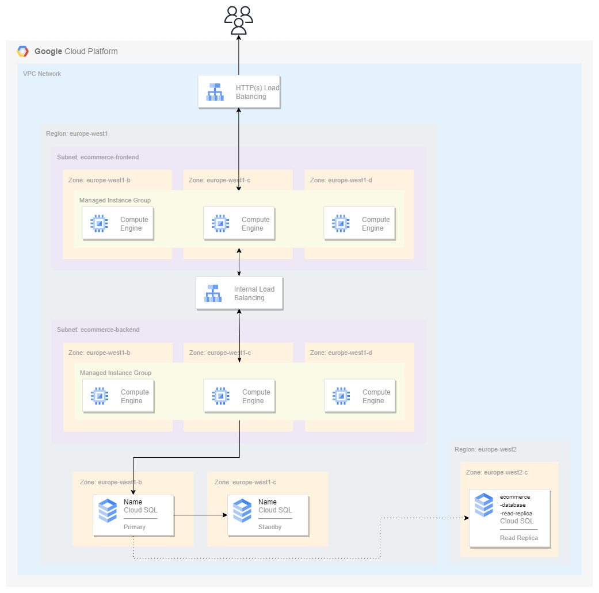

# Practice architecture project

This project is designed to improve skills related to:

- Cloud architecture design
- Google Cloud Services
- Use of Terraform

## Storytelling

We are a company that works with Google Cloud, and we help our clients deploy their on-premises infrastructures to the Public Cloud. In this case, we have to deploy an e-commerce webpage which has to be highly available for European clients, and must be scalable as we will have changing traffics.

The current application is built in a three layer architecture. We have a Frontend application that connects to a Backend, and a database to store all the application data.

## Architecture

The following picture shows the architecture that is going to be created in this project.



## Example of usage

Example of the `terraform.tfvars` file that has been created to check the created infrastructure:

```hcl
region      = "europe-west1"
gcp_project = "gcp-project"

# Networking module
network_name = "ecommerce-network"
subnetworks = [
  {
    subnetwork_name = "ecommerce-frontend"
    ip_cidr_range   = "10.0.1.0/24"
    region          = "europe-west1"
  },
  {
    subnetwork_name = "ecommerce-backend"
    ip_cidr_range   = "10.0.2.0/24"
    region          = "europe-west1"
  }
]

firewall_rules = [
  {
    firewall_rule_name = "ecommerce-icmp-allow"
    ranges             = ["0.0.0.0/0"]
    target_tags        = ["ecommerce-servers"]
    source_tags        = []

    allow = [{
      protocol = "icmp"
    }]
  },
  {
    firewall_rule_name = "ecommerce-ssh-allow"
    ranges             = ["0.0.0.0/0"]
    target_tags        = ["ecommerce-servers"]
    source_tags        = []

    allow = [{
      protocol = "tcp"
      ports    = ["22"]
    }]
  },
  {
    firewall_rule_name = "ecommerce-http-allow"
    ranges             = ["0.0.0.0/0"]
    target_tags        = ["ecommerce-frontend-servers"]
    source_tags        = []

    allow = [{
      protocol = "tcp"
      ports    = ["80"]
    }]
  },
  {
    firewall_rule_name = "ecommerce-python-server-allow"
    ranges             = ["0.0.0.0/0"] #["10.0.1.0/24",  "35.191.0.0/16", "130.211.0.0/22"]
    target_tags        = ["ecommerce-backend-servers"]
    source_tags        = []

    allow = [{
      protocol = "tcp"
      ports    = ["80"]
    }]
  }
]


# Instances module
instances = {
  "ecommerce-frontend-instance-template" = {
    network_tags            = ["ecommerce-servers", "ecommerce-frontend-servers"]
    machine_type            = "e2-medium"
    source_image            = "debian-cloud/debian-11"
    instances_network       = "ecommerce-network"
    instances_subnetwork    = "ecommerce-frontend"
    metadata_startup_script = <<-EOT
        #!/bin/bash
        sudo apt-get update
        sudo apt-get install -y nginx
        sudo systemctl start nginx
        EOT

    health_check_name            = "ecommerce-frontend-health-check"
    instances_check_interval_sec = 5
    instances_timeout_sec        = 2
    healthy_threshold            = 2
    unhealthy_threshold          = 10
    request_path                 = "/"
    instances_port               = "80"

    autoscaler_name        = "ecommerce-frontend-autoscaler"
    autoscaler_region      = "europe-west1"
    max_replicas           = 5
    min_replicas           = 1
    cooldown_period        = 300
    target_cpu_utilization = 0.6

    instance_group_name        = "ecommerce-frontend-instance-group"
    base_instance_name         = "ecommerce-frontend-instance"
    main_instance_group_region = "europe-west1"
    distribution_policy_zones  = ["europe-west1-b", "europe-west1-c", "europe-west1-d"]
    initial_delay_sec          = 300
  },
  "ecommerce-backend-instance-template" = {
    network_tags            = ["ecommerce-servers", "ecommerce-backend-servers"]
    machine_type            = "e2-medium"
    source_image            = "debian-cloud/debian-11"
    instances_network       = "ecommerce-network"
    instances_subnetwork    = "ecommerce-backend"
    metadata_startup_script = <<-EOT
        #!/bin/bash
        python3 -m http.server 80
        EOT

    health_check_name            = "ecommerce-backend-health-check"
    instances_check_interval_sec = 5
    instances_timeout_sec        = 2
    healthy_threshold            = 2
    unhealthy_threshold          = 10
    request_path                 = "/"
    instances_port               = "80"

    autoscaler_name        = "ecommerce-backend-autoscaler"
    autoscaler_region      = "europe-west1"
    max_replicas           = 5
    min_replicas           = 1
    cooldown_period        = 300
    target_cpu_utilization = 0.6

    instance_group_name        = "ecommerce-backend-instance-group"
    base_instance_name         = "ecommerce-backend-instance"
    main_instance_group_region = "europe-west1"
    distribution_policy_zones  = ["europe-west1-b", "europe-west1-c", "europe-west1-d"]
    initial_delay_sec          = 300
  }
}

# Databases module
/*private_ip_address_name    = "database-private-ip"
prefix_length              = 24
database_network           = "projects/my-project/global/networks/ecommerce-network"
database_name              = "ecommerce-database"
database_version           = "MYSQL_8_0"
database_region            = "europe-west1"
database_tier              = "db-f1-micro"
availability_type          = "REGIONAL"
disk_size                  = "100"
database_read_replica_name = "ecommerce-database-read-replica"
read_replica_region        = "europe-west2"*/


# External load balancer module
external_lb_forwarding_rule_name  = "ecommerce-external-lb-forwarding-rule"
external_lb_ip_protocol           = "TCP"
external_lb_load_balancing_scheme = "EXTERNAL"
external_lb_port_range            = "80"

external_lb_backend_name   = "ecommerce-external-lb-backend"
external_lb_protocol       = "TCP"
external_lb_balancing_mode = "CONNECTION"

external_lb_health_check_name  = "ecommerce-external-lb-health-check"
external_lb_check_interval_sec = 1
external_lb_timeout_sec        = 1
external_lb_port               = 80

# Internal load balancer module
internal_lb_network    = "ecommerce-network"
internal_lb_subnetwork = "ecommerce-backend"

internal_lb_subnet_name = "lb-subnetwork"
subnet_ip_cidr_range    = "10.0.0.0/24"
subnet_purpose          = "INTERNAL_HTTPS_LOAD_BALANCER"
subnet_role             = "ACTIVE"

internal_lb_forwarding_rule_name  = "ecommerce-internal-lb-forwarding-rule"
internal_lb_ip_protocol           = "TCP"
internal_lb_load_balancing_scheme = "INTERNAL_MANAGED"
port_name                         = "http"
internal_lb_port_range            = "80"
network_tier                      = "PREMIUM"

lb_region_target_http_proxy_name = "ecommerce-internal-lb-region-target-http-proxy"

lb_region_url_map_name = "ecommerce-internal-lb-region-url-map"

internal_lb_backend_name      = "ecommerce-internal-lb-backend"
internal_lb_protocol          = "HTTP"
backend_load_balancing_scheme = "INTERNAL_MANAGED"
internal_lb_balancing_mode    = "UTILIZATION"
capacity_scaler               = 1.0

internal_lb_health_check_name  = "ecommerce-internal-lb-health-check"
internal_lb_check_interval_sec = 1
internal_lb_timeout_sec        = 1
internal_lb_port               = 80
```

